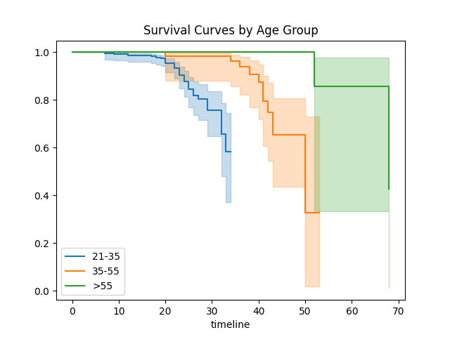
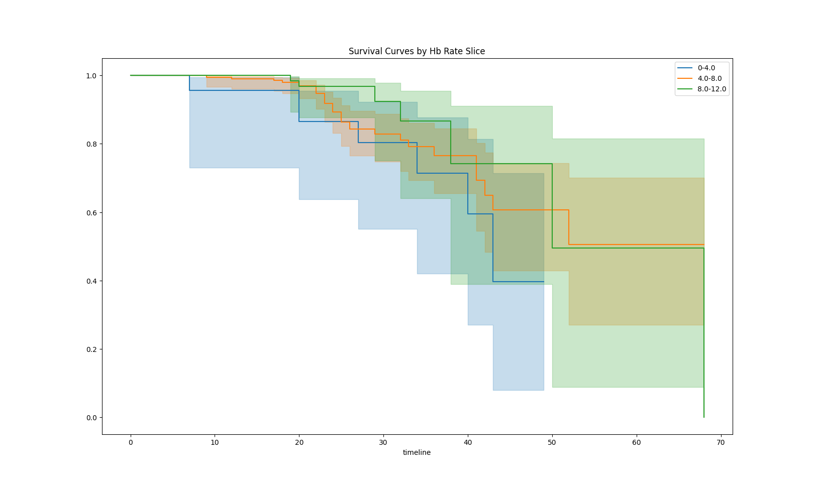
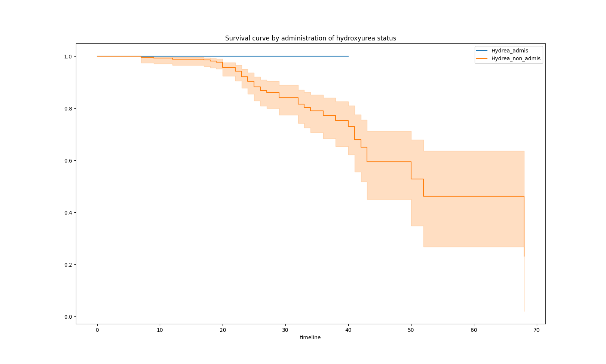
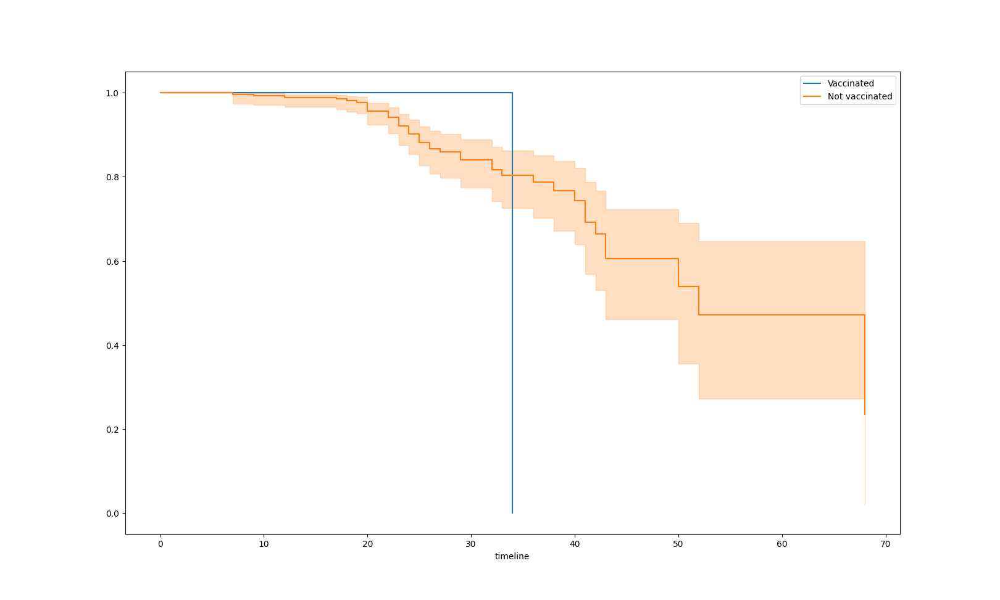

<h1> ANALYSIS OF SURVIVAL IN SICKLE CELL DISEASE PATIENTS ACCORDING TO VACCINATION STATUS WITH DETERMINATION OF P </h1>

<table>
<tr>
    <td></td>
    <td></td>
</tr>
<tr>
    <td></td>
    <td></td>
</tr>
</table>

To produce a survival curve of sickle cell patients according to vaccination status with determination of the p-value, the variables required in your dataset will include :

1. **Patient ID** : A unique identifier for every patient.
2. **Follow-up time** : Duration of follow-up for each patient (in months, days, or years).
3. **Survival Event** : A binary variable indicating whether the survival event (death or other condition of interest) occurred (1) or not (0) during the follow-up period.
4. **Vaccine Status** : A variable indicating patients' vaccination status (vaccinated or unvaccinated).
5. **Follow-up start date** : Date on which patient follow-up began.
6. **Potential Covariates** : Other clinical or demographic variables that could influence survival (age, sex, type of sickle cell disease, treatments received, comorbidities, etc.).

With our variables, we will use statistical methods such as Kaplan-Meier survival analysis to estimate the survival curve, and the log-rank test to compare the survival curves between the vaccinated and unvaccinated patient groups, which will allow us to determine the p-value associated with this comparison.

Description of the files used in the project :

- [analysis_func.py](analysis_func.py) : Contains all the simple and complex functions that could be use for analysis in the project.
- [analysis_load.py](analysis_load.py) : The script which completely launches the analysis.
- [data_cleaning.py](data_cleaning.py) : This python script is use to clean the initial dataset to produce a clean dataset for analysis.
- [obj1.py](obj1.py) : In this file we have the main analysis coded, data cleaning, kaplan-meier survival curve design, etc...

# 1. Data cleaning

The first step consist to import analysis functions necessary for data loading and cleaning as shown below:

```python
# Import tools for the data cleaning
from analysis_func import *
```

After importing the analysis tools we need to call the [load_data](analysis_func.py#L20-L24) function from the analysis_func.py file to load the data.

```python
# First build the dataframe
df = load_data()
```

To remove the observations with null values in key variables we used the dropna() function as shown below:

```python
# Remove rows with null values in key variables
df = df.dropna(subset=['CODE', 'AGE', 'SEXE', 'NIVEAUSCOLAIRE', 'STATUTMARITAL', 'ETHNIE', 'AGE_DE_DIAGNOSTIC', 'DECEDES', 'VACCINSAJOUR'])
```

We also removed null and non numeric values in the code (Patients' ID)

```python
# Remove rows with null or non numeric values in the code variable
df['CODE'] = pd.to_numeric(df['CODE'], errors='coerce')
df = df.dropna(subset=['CODE'])
```

To ensure data coherency in the age variable we had to remove observations with age lower than 0 and greater than 90

```python
# Remove rows with age values not in a limit
min_age = 0
max_age = 90
df = df[(df['AGE'] >= min_age) & (df['AGE'] <= max_age)]
```

Data inconsistency in the sex variable was ensure by filtering out observations with sex variables neither 1 or 2, neither M or F

```python
# Remove rows with sex not Male or Female, 1 or 2, M or F
df = df[(df['SEXE'] != 1) | (df['SEXE'] != 2)]
```

To have consistency in the age of diagnostic variable we had to harmonize the values by removing text fields like "ANS" and "AN" following the year value. We had to convert values in months to 1 year and replace all text fields ("INCONNU", "INCONU") to `Nan`

```python
# Harmonize age at diagnosis
# Remove "ANS" and "AN" 
df['AGE_DE_DIAGNOSTIC'] = df['AGE_DE_DIAGNOSTIC'].str.replace("ANS|AN", "", regex=True)
# Convert elements with "MOIS" to 1 year
df.loc[df['AGE_DE_DIAGNOSTIC'].str.contains('MOIS'), 'AGE_DE_DIAGNOSTIC'] = 1
# Replace "INCONNU" and "INCONU" with NaN
df['AGE_DE_DIAGNOSTIC'] = df['AGE_DE_DIAGNOSTIC'].replace(["INCONNU", "INCONU"], np.nan)
df.to_excel('data_cleaned.xlsx', index=False)
```

The `to_excel()` function is used to create the excel format of the cleaned data

# 2. Data Manipulation and Preparation

After loading and cleaning the inital dataset, we filter from the cleaned dataset the important variables to the analysis. Given the main objectives of the analysis are :

- Survival curve of sickle cell patients by age groups
- Survival curve of sickle cell patients by Haemoglobin rate
- Survival curve of sickle cell patients by administration to hydroxyurea
- Survival curve of sickle cell patients by vaccine status

Following this targeted curves, we needed to filter key variables as shown below :

```python
# Filter key variables
df = df[['CODE', 'AGE', 'SEXE', 'NIVEAUSCOLAIRE', 'STATUTMARITAL', 'ETHNIE', 'AGE_DE_DIAGNOSTIC', 'DECEDES', 'VACCINSAJOUR',
            'AGEAUDECES', 'TAUXHB', 'HYDREA']]
```

We further harmonize the deceased variable by replacing '2' with '0' to have only 1s and 0s are only binary outcomes.

```python
# Replace 2 by 0 and leave out the 1 in the death variable
df['DECEDES'] = df['DECEDES'].replace(2,0)
```

As we said earlier, we need to have the Follow-up time variable in our dataset. So we had to mutate the dataset to create this new variable. It is a derived variable from the age at diagnosis and age of patient

```python
# Adding new variable timeline
df['timeline'] = np.where(df['AGE_DE_DIAGNOSTIC'].isnull(), df['AGE'], df['AGE'] - df['AGE_DE_DIAGNOSTIC'])
```

# 3. Data Analysis

To design the survival curve we first need to import key python modules as shown below:

```python
from lifelines import KaplanMeierFitter
from lifelines.statistics import logrank_test,multivariate_logrank_test
```

We first import the KaplanMeierFitter() module

```python
# Kaplan-Meier Fitter
kmf = KaplanMeierFitter()
```

We then seperate the patients into `vaccinated` and non vaccinated pateints (`not_vaccinated`)

```python
# Patients seperation
vaccinated = df[df['VACCINSAJOUR'] == 1]
not_vaccinated = df[df['VACCINSAJOUR'] == 2]
```

## 3.1 Survival curve of sickle cell patients by vaccine status

To draw the survival curve of sickle cell patients by vaccine status, we had to use the fit() and plot_survival_function() functions of the Kaplan-Meier module. Then the plt module was used to give a title to the curve and display the curve.

```python
# Adjustment and tracing for vaccine patients
kmf.fit(vaccinated['timeline'], event_observed=vaccinated['DECEDES'], label='Vaccinated')
ax = kmf.plot_survival_function()

# Adjustment and tracing for non-vaccine patients
kmf.fit(not_vaccinated['timeline'], event_observed=not_vaccinated['DECEDES'], label='Not vaccinated')
kmf.plot_survival_function(ax=ax)

plt.title("Survival curve by vaccination status")
plt.show()
```

***SURVIVAL CURVE BY VACCINATION STATUS***


To have the p value for the differential signification we used the logrank_test of statistics from lifelines modules as shown below:

```python
# Test du log-rank
results = logrank_test(vaccinated['timeline'], not_vaccinated['timeline'], event_observed_A=vaccinated['DECEDES'], event_observed_B=not_vaccinated['DECEDES'])
print(results.summary)
```

## 3.2 Survival curve of sickle cell patients by age groups

The other curves was different from the first one because we had to represent not only vaccinated or not sickle cell patients but depending on their age groups (*21-35, 35-55, more than 55*). To do that we had to create age groups and design the curve in a looping script as shown below:

```python
df['Age_Group'] = pd.cut(df['AGE'], bins=[20,34,54,70], labels=['21-35','35-55','>55'])
    
# Plot the curve for each age group
fig, ax = plt.subplots()
for label, grouped_df in df.groupby('Age_Group'):
    kmf.fit(grouped_df['timeline'], event_observed=grouped_df['DECEDES'], label=label)
    kmf.plot_survival_function(ax=ax)
    
plt.title('Survival Curves by Age Group')
plt.show()
```

***SURVIVAL CURVE OF SICKLE CELL PATIENTS BY AGE GROUPS***


